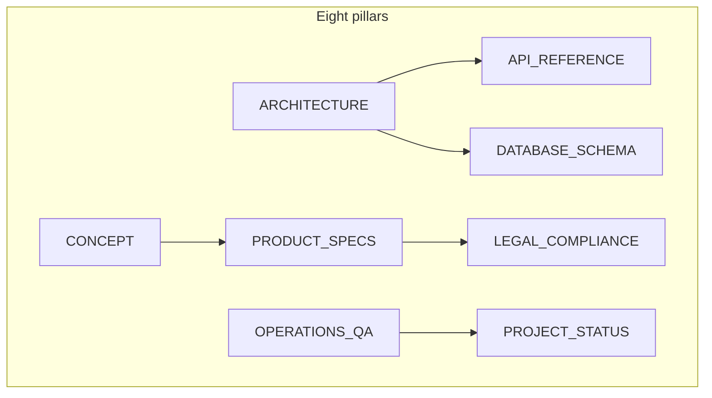

# go-daily — documentation hub

This tree is the **canonical** technical and product reference for go-daily: **eight pillars** × **four locales** (`en`, `zh`, `ja`, `ko`). It is written for **operators, engineers, product/legal stakeholders**, and contributors auditing the system — not end-user marketing copy (that lives on the product site).

**Choose your language:** [English](en/CONCEPT.md) · [中文](zh/CONCEPT.md) · [日本語](ja/CONCEPT.md) · [한국어](ko/CONCEPT.md)

---

## Repository map (where code lives)

| Path | Role |
| ---- | ---- |
| `app/` | Next.js App Router — `app/[locale]/` pages, `app/api/` route handlers |
| `lib/` | Domain logic (nine domains: auth, board, coach, i18n, puzzle, storage, posthog, stripe, supabase — see Architecture) |
| `content/` | Puzzle data, static messages |
| `proxy.ts` | Global middleware: session refresh, locale negotiation, route guarding |
| `types/` | Zod schemas (`types/schemas.ts`) — shared contracts |
| `tests/` | Vitest suites (mirror structure under `tests/lib`, `tests/api`, …) |

---

## How to read this library (by audience)

| Role | Typical path |
| ---- | ------------ |
| **Product / GTM** | [CONCEPT](en/CONCEPT.md) → [PRODUCT_SPECS](en/PRODUCT_SPECS.md) → [PROJECT_STATUS](en/PROJECT_STATUS.md) |
| **Engineering** | [ARCHITECTURE](en/ARCHITECTURE.md) → [API_REFERENCE](en/API_REFERENCE.md) → [DATABASE_SCHEMA](en/DATABASE_SCHEMA.md) |
| **DevOps / SRE** | [OPERATIONS_QA](en/OPERATIONS_QA.md) → [PROJECT_STATUS](en/PROJECT_STATUS.md) |
| **Legal / compliance** | [LEGAL_COMPLIANCE](en/LEGAL_COMPLIANCE.md) → [PRODUCT_SPECS](en/PRODUCT_SPECS.md) (entitlements) |

---

## Documentation pillars (by topic)

| # | Pillar | Description |
| - | ------ | ----------- |
| 1 | [Concept & strategy](en/CONCEPT.md) | Mission, phased growth, lean engineering, content ethics |
| 2 | [Architecture](en/ARCHITECTURE.md) | `proxy.ts`, nine-domain `lib/`, storage & security model |
| 3 | [Product specifications](en/PRODUCT_SPECS.md) | Entitlements, SRS, subscriptions, coach eligibility |
| 4 | [Operations & QA](en/OPERATIONS_QA.md) | Deploy stack, env, testing, preflight |
| 5 | [Project status](en/PROJECT_STATUS.md) | Readiness / delivery tracking |
| 6 | [API reference](en/API_REFERENCE.md) | Route catalog, request/response shapes |
| 7 | [Database schema](en/DATABASE_SCHEMA.md) | Tables, indexes, RLS |
| 8 | [Legal & compliance](en/LEGAL_COMPLIANCE.md) | Multi-jurisdiction strategy |

---

## Locale coverage

| Document | [English](en/) | [中文](zh/) | [日本語](ja/) | [한국어](ko/) |
| -------- | :------------: | :---------: | :-----------: | :-----------: |
| Concept & strategy | ✓ | ✓ | ✓ | ✓ |
| Architecture | ✓ | ✓ | ✓ | ✓ |
| Product specifications | ✓ | ✓ | ✓ | ✓ |
| Operations & QA | ✓ | ✓ | ✓ | ✓ |
| Project status | ✓ | ✓ | ✓ | ✓ |
| API reference | ✓ | ✓ | ✓ | ✓ |
| Database schema | ✓ | ✓ | ✓ | ✓ |
| Legal & compliance | ✓ | ✓ | ✓ | ✓ |

---

## Root-level companions (repository)

| Document | Audience |
| -------- | -------- |
| [README.md](../README.md) | Everyone — product + engineering overview |
| [CHANGELOG.md](../CHANGELOG.md) | Release history |
| [SECURITY.md](../SECURITY.md) | Vulnerability reporting |
| [LICENSE](../LICENSE) | Copyright and terms |
| [CONTRIBUTING.md](../CONTRIBUTING.md) | Contributors (English; GitHub default) |
| [CONTRIBUTING.zh.md](../CONTRIBUTING.zh.md) | 贡献指南（中文） |
| [AGENTS.md](../AGENTS.md) | **Maintainers & AI tooling** — coding-agent conventions; optional for human contributors |

---

## Automated reports (local only)

Scripts write audit outputs under `reports/` (`npm run queue:content`, `npm run report:*`, `npm run audit:puzzles`). Those artifacts are **gitignored** and **not** part of this documentation set — regenerate locally when needed. Operational truth remains in `docs/{locale}/`.

| Output (local) | Script | Description |
| -------------- | ------ | ----------- |
| `reports/content-queue/latest.{md,json}` | `npm run queue:content` | Coach-ready puzzle inventory |
| `reports/duplicates/latest.{md,json}` | `npm run report:duplicates` | Duplicate board-position analysis |
| `reports/quality/latest.{md,json}` | `npm run report:quality` | Solution-note quality sampling |
| `reports/puzzle-audit/latest.{md,json}` | `npm run audit:puzzles` | Distribution and balance stats |
