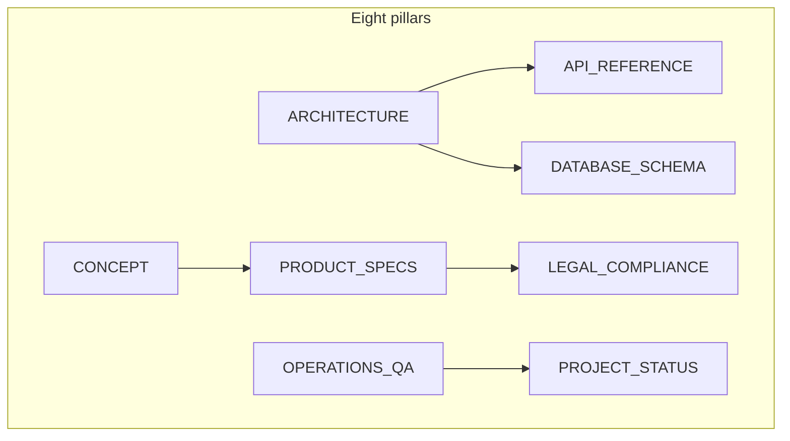

# go-daily — documentation hub · 文档索引 · ドキュメント · 문서 허브

**Choose your language:** [English](en/CONCEPT.md) · [中文](zh/CONCEPT.md) · [日本語](ja/CONCEPT.md) · [한국어](ko/CONCEPT.md)

### English

This tree is the **canonical** technical and product reference for go-daily: **eight pillars** × **four locales** (`en`, `zh`, `ja`, `ko`). It is written for **operators, engineers, product/legal stakeholders**, and contributors auditing the system — not end-user marketing copy (that lives on the product site).

### 中文

本目录是 go-daily **权威的**技术与产品参考资料：**八大主题** × **四种语言版本**（`en` / `zh` / `ja` / `ko`）。读者对象为**运维、工程、产品/法务相关方**及参与审计的贡献者，**不是**面向终端用户的营销文案（此类内容在产品站点）。

### 日本語

本ツリーは go-daily の**正規**な技術・プロダクト資料です。**8 本の柱** × **4 ロケール**（`en` / `zh` / `ja` / `ko`）。**運用担当・エンジニア・プロダクト／法務関係者**およびシステム監査・コントリビュータ向けであり、エンドユーザー向けマーケティング本文ではありません（プロダクトサイト側の内容です）。

### 한국어

이 디렉터리는 go-daily의 **단일 원본(canonical)** 기술·제품 참고 자료입니다. **8개 기둥 문서** × **4개 로케일**(`en`, `zh`, `ja`, `ko`). **운영·엔지니어링·제품/법무 이해관계자**와 시스템 감사·기여자를 위해 작성되었으며, 최종 사용자용 마케팅 카피가 아닙니다 (제품 사이트에 해당).

---

## Public disclosure & data safety

### English

These files are **published with the repository** (e.g. on GitHub). They are written for transparency—operators, engineers, auditors, and contributors—not as end-user marketing.

- **Do not** paste live secrets (API keys, `ADMIN_PIN`, `CRON_SECRET`, Stripe/webhook secrets, `SUPABASE_SERVICE_ROLE_KEY`, etc.) into issues, PRs, or forks of this documentation. Use placeholders and rotate anything that was ever exposed.
- **Operator mechanics** (admin allowlists, cron `Authorization: Bearer`, rate limits) describe _how deployment is secured_, not invitations to probe production: always test against your own instance.
- **API Reference** and **Database schema** name environment variables and tables so self-hosters can configure systems correctly; keep production values out of version control (`.env.local` remains gitignored).

### 中文（公开披露与数据安全）

这些文档随**代码仓库一并公开**（例如 GitHub）。目的是透明地向**运维、工程、审计与贡献者**说明系统，**不是**终端用户营销材料。

- **禁止**在 issue、PR 或文档副本中粘贴真实密钥（API key、`ADMIN_PIN`、`CRON_SECRET`、Stripe/Webhook 密钥、`SUPABASE_SERVICE_ROLE_KEY` 等）。请使用占位符；若曾有泄露须轮换。
- **运维机制**（管理白名单、Cron 的 `Authorization: Bearer`、限流等）说明**如何正确加固部署**，而非鼓励探测他人生产环境；请在**自有实例**上测试。
- **API 参考**与**数据库结构**会写出环境变量名与表名，便于自托管配置正确；生产环境**取值**须留在版本控制之外（`.env.local` 等仍应 gitignore）。

### 日本語（公開リポジトリとデータの取り扱い）

これらの文書は**リポジトリとともに公開**されます（例: GitHub）。**運用・エンジニア・監査・コントリビュータ**への透明性のためのものであり、エンドユーザー向けマーケティングではありません。

- **本番の秘密**（API キー、`ADMIN_PIN`、`CRON_SECRET`、Stripe/Webhook シークレット、`SUPABASE_SERVICE_ROLE_KEY` など）を issue、PR、フォークした文書に**貼らない**。プレースホルダを使い、露出したものはローテーションする。
- **運用設計**（管理許可リスト、Cron の `Authorization: Bearer`、レート制限など）は、**どう守るか**を説明するものであり、他者本番への探索を推奨するものではない。**自分の環境**で検証すること。
- **API リファレンス**と**データベーススキーマ**は自ホスト向けに環境変数名やテーブル名を列挙する。**値**はリポジトリ外（`.env.local` は引き続き gitignore）に置く。

### 한국어（공개 저장소·보안·데이터）

이 문서들은 **저장소와 함께 공개**됩니다(예: GitHub). **운영·엔지니어링·감사·기여자**를 위한 투명성용이며, 최종 사용자 마케팅 자료가 아닙니다.

- **라이브 비밀**(API 키, `ADMIN_PIN`, `CRON_SECRET`, Stripe/Webhook 시크릿, `SUPABASE_SERVICE_ROLE_KEY` 등)을 이슈·PR·문서 포크에 **붙여 넣지 마세요**. 자리 표시자를 쓰고, 노출된 적이 있으면 교체(rotate)하세요.
- **운영 메커니즘**(관리 허용 목록, Cron `Authorization: Bearer`, 속도 제한 등)은 **배포를 어떻게 보호하는지**를 설명하는 것이며, 타인 프로덕션을 탐색하라는 의미가 아닙니다. **본인 인스턴스**에서 검증하세요.
- **API 레퍼런스**와 **데이터베이스 스키마**는 자가 호스팅 구성을 돕기 위해 환경 변수 이름·테이블 이름을 적습니다. **실제 값**은 버전 관리 밖(`.env.local`은 계속 gitignore)에 두세요.

---

## Repository map (where code lives)

| Path       | Role                                                                                                                 |
| ---------- | -------------------------------------------------------------------------------------------------------------------- |
| `app/`     | Next.js App Router — `app/[locale]/` pages, `app/api/` route handlers                                                |
| `lib/`     | Domain logic (nine domains: auth, board, coach, i18n, puzzle, storage, posthog, stripe, supabase — see Architecture) |
| `content/` | Puzzle data, static messages                                                                                         |
| `proxy.ts` | Next.js 16 app-root **proxy** (replaces `middleware.ts`): session refresh, locale negotiation, route guarding        |
| `types/`   | Zod schemas (`types/schemas.ts`) — shared contracts                                                                  |
| `tests/`   | Vitest suites (mirror structure under `tests/lib`, `tests/api`, …)                                                   |

### Path notes · 路径说明 · パス説明 · 경로 안내

**中文** — `app/`：Next.js App Router，多语言页面 `app/[locale]/` 与 `app/api/` 路由；`lib/`：九大领域业务逻辑（auth、board、coach 等）；`content/`：题目与静态文案；`proxy.ts`：Next.js 16 应用根代理（会话刷新、语言协商、路由守卫）；`types/`：Zod 共享契约；`tests/`：Vitest，目录结构镜像源码。

**日本語** — `app/`：App Router、`app/[locale]/` のページと `app/api/`；`lib/`：9 ドメインのビジネスロジック；`content/`：パズルデータとメッセージ；`proxy.ts`：アプリルートのプロキシ（セッション・ロケール・ガード）；`types/`：Zod 契約；`tests/`：Vitest、ソースツリーのミラー。

**한국어** — `app/`：App Router, `app/[locale]/` 페이지 및 `app/api/` 핸들러；`lib/`：9개 도메인 로직；`content/`：퍼즐·메시지；`proxy.ts`：앱 루트 프록시(세션·로케일·가드)；`types/`：Zod 스키마；`tests/`：Vitest, 소스 구조 미러.

---

## How to read this library (by audience)

| Role                   | Typical path                                                                                                         |
| ---------------------- | -------------------------------------------------------------------------------------------------------------------- |
| **Product / GTM**      | [CONCEPT](en/CONCEPT.md) → [PRODUCT_SPECS](en/PRODUCT_SPECS.md) → [PROJECT_STATUS](en/PROJECT_STATUS.md)             |
| **Engineering**        | [ARCHITECTURE](en/ARCHITECTURE.md) → [API_REFERENCE](en/API_REFERENCE.md) → [DATABASE_SCHEMA](en/DATABASE_SCHEMA.md) |
| **DevOps / SRE**       | [OPERATIONS_QA](en/OPERATIONS_QA.md) → [PROJECT_STATUS](en/PROJECT_STATUS.md)                                        |
| **Legal / compliance** | [LEGAL_COMPLIANCE](en/LEGAL_COMPLIANCE.md) → [PRODUCT_SPECS](en/PRODUCT_SPECS.md) (entitlements)                     |

### Audience paths · 分角色阅读 · ロール別 · 역할별 읽기법

**中文** — **产品/GTM**：概念 → 产品规格 → 项目状态。**工程**：架构 → API 参考 → 数据库结构。**DevOps/SRE**：运维与质量保障 → 项目状态。**法务/合规**：法律与合规 → 产品规格（权益）。下列链接以 `en/` 为例；请改用 [zh](zh/CONCEPT.md)、[ja](ja/CONCEPT.md)、[ko](ko/CONCEPT.md) 等同级路径即可。

**日本語** — **プロダクト**：CONCEPT → PRODUCT_SPECS → PROJECT_STATUS。**エンジニアリング**：ARCHITECTURE → API_REFERENCE → DATABASE_SCHEMA。**DevOps/SRE**：OPERATIONS_QA → PROJECT_STATUS。**法務**：LEGAL_COMPLIANCE → PRODUCT_SPECS（エンタイトルメント）。リンクは `en/` 起点；[ja](ja/CONCEPT.md) など同じファイル名で読み替え可能。

**한국어** — **제품**: CONCEPT → PRODUCT_SPECS → PROJECT_STATUS.**엔지니어링**: ARCHITECTURE → API_REFERENCE → DATABASE_SCHEMA.**DevOps/SRE**: OPERATIONS_QA → PROJECT_STATUS.**법무**: LEGAL_COMPLIANCE → PRODUCT_SPECS(자격). 링크는 `en/` 기준；[ko](ko/CONCEPT.md) 등 동일 파일명으로 교체.

### Diagram note · 关系图说明 · 図の注 · 다이어그램 안내

**中文** — 上图为英文缩写节点，与各柱 **Markdown 文件名**（如 `CONCEPT.md`）一致。

**日本語** — 図のラベルは英語略称で、各柱の **Markdown ファイル名**（例: `CONCEPT.md`）に対応します。

**한국어** — 위 그림의 노드는 영문 약어이며 각 기둥 **Markdown 파일명**(예: `CONCEPT.md`)과 같습니다.

---

## Documentation pillars (by topic)

| #   | Pillar                                        | Description                                              |
| --- | --------------------------------------------- | -------------------------------------------------------- |
| 1   | [Concept & strategy](en/CONCEPT.md)           | Mission, phased growth, lean engineering, content ethics |
| 2   | [Architecture](en/ARCHITECTURE.md)            | `proxy.ts`, nine-domain `lib/`, storage & security model |
| 3   | [Product specifications](en/PRODUCT_SPECS.md) | Entitlements, SRS, subscriptions, coach eligibility      |
| 4   | [Operations & QA](en/OPERATIONS_QA.md)        | Deploy stack, env, testing, preflight                    |
| 5   | [Project status](en/PROJECT_STATUS.md)        | Readiness / delivery tracking                            |
| 6   | [API reference](en/API_REFERENCE.md)          | Route catalog, request/response shapes                   |
| 7   | [Database schema](en/DATABASE_SCHEMA.md)      | Tables, indexes, RLS                                     |
| 8   | [Legal & compliance](en/LEGAL_COMPLIANCE.md)  | Multi-jurisdiction strategy                              |

### Pillar descriptions · 各柱简介 · 各柱の説明 · 기둥 설명

**中文** — 1 愿景与阶段战略；2 `proxy.ts` 与九大 `lib/` 域、存储与安全；3 权益、SRS、订阅、教练资格；4 部署栈、环境、测试、预检；5 交付与路线图线索；6 HTTP 路由与请求体；7 表、索引、RLS；8 多司法管辖区策略。

**日本語** — 1 ミッション・フェーズ戦略；2 `proxy.ts` と 9 ドメイン `lib/`、永続化とセキュリティ；3 エンタイトルメント、SRS、サブスク、コーチ対象；4 デプロイ・環境・テスト・プレフライト；5 リリース準備・追跡；6 API カタログ；7 テーブル・インデックス・RLS；8 複数法域。

**한국어** — 1 미션·단계 전략；2 `proxy.ts`, 9 도메인 `lib/`, 저장·보안；3 권한, SRS, 구독, 코치 자격；4 배포, 환경, 테스트, 프리플라이트；5 준비도·추적；6 API 목록；7 테이블·인덱스·RLS；8 다중 관할.

---

## Locale coverage

| Document               | [English](en/) | [中文](zh/) | [日本語](ja/) | [한국어](ko/) |
| ---------------------- | :------------: | :---------: | :-----------: | :-----------: |
| Concept & strategy     |       ✓        |      ✓      |       ✓       |       ✓       |
| Architecture           |       ✓        |      ✓      |       ✓       |       ✓       |
| Product specifications |       ✓        |      ✓      |       ✓       |       ✓       |
| Operations & QA        |       ✓        |      ✓      |       ✓       |       ✓       |
| Project status         |       ✓        |      ✓      |       ✓       |       ✓       |
| API reference          |       ✓        |      ✓      |       ✓       |       ✓       |
| Database schema        |       ✓        |      ✓      |       ✓       |       ✓       |
| Legal & compliance     |       ✓        |      ✓      |       ✓       |       ✓       |

### Table column · 「Document」译名 · 文書名 · 문서 명칭

| English (left)         | 中文           | 日本語                 | 한국어              |
| ---------------------- | -------------- | ---------------------- | ------------------- |
| Concept & strategy     | 概念与战略     | コンセプト・戦略       | 컨셉·전략           |
| Architecture           | 架构           | アーキテクチャ         | 아키텍처            |
| Product specifications | 产品规格       | プロダクト仕様         | 제품 사양           |
| Operations & QA        | 运维与质量保障 | 運用と QA              | 운영·QA             |
| Project status         | 项目状态       | プロジェクトステータス | 프로젝트 상태       |
| API reference          | API 参考       | API リファレンス       | API 레퍼런스        |
| Database schema        | 数据库结构     | データベーススキーマ   | 데이터베이스 스키마 |
| Legal & compliance     | 法律与合规     | 法務・コンプライアンス | 법무·컴플라이언스   |

---

## Root-level companions (repository)

| Document                                    | Audience                                                                                 |
| ------------------------------------------- | ---------------------------------------------------------------------------------------- |
| [README.md](../README.md)                   | Everyone — product + engineering overview                                                |
| [CHANGELOG.md](../CHANGELOG.md)             | Release history                                                                          |
| [SECURITY.md](../SECURITY.md)               | Vulnerability reporting                                                                  |
| [LICENSE](../LICENSE)                       | Copyright and terms                                                                      |
| [CONTRIBUTING.md](../CONTRIBUTING.md)       | Contributors (English; GitHub default)                                                   |
| [CONTRIBUTING.zh.md](../CONTRIBUTING.zh.md) | 贡献指南（中文）                                                                         |
| [AGENTS.md](../AGENTS.md)                   | **Maintainers & AI tooling** — coding-agent conventions; optional for human contributors |

### Audience notes · 读者对象 · 対象読者 · 대상

**中文** — 根目录 `README`：产品与工程总览；`CHANGELOG`：版本历史；`SECURITY`：漏洞报告；`LICENSE`：版权与条款；`CONTRIBUTING`：贡献指南（英文默认）；`CONTRIBUTING.zh`：中文贡献指南；`AGENTS`：维护者与 AI 辅助开发约定（人选读）。

**日本語** — ルート README：製品・技術概要；CHANGELOG：履歴；SECURITY：脆弱性報告；LICENSE：著作権；CONTRIBUTING：コントリビュート（英語デフォルト）；CONTRIBUTING.zh：中国語版；AGENTS：メンテナ／AI エージェント向け慣習。

**한국어** — README: 제품·엔지니어링 개요；CHANGELOG: 변경 이력；SECURITY: 취약점 신고；LICENSE: 저작권；CONTRIBUTING: 기여(영문 기본)；CONTRIBUTING.zh: 중문 가이드；AGENTS: 메인터넌스·AI 도구 규약.

---

## Automated reports (local only)

Scripts write audit outputs under `reports/` (`npm run queue:content`, `npm run report:*`, `npm run audit:puzzles`). Those artifacts are **gitignored** and **not** part of this documentation set — regenerate locally when needed. Operational truth remains in `docs/{locale}/`.

| Output (local)                           | Script                      | Description                       |
| ---------------------------------------- | --------------------------- | --------------------------------- |
| `reports/content-queue/latest.{md,json}` | `npm run queue:content`     | Coach-ready puzzle inventory      |
| `reports/duplicates/latest.{md,json}`    | `npm run report:duplicates` | Duplicate board-position analysis |
| `reports/quality/latest.{md,json}`       | `npm run report:quality`    | Solution-note quality sampling    |
| `reports/puzzle-audit/latest.{md,json}`  | `npm run audit:puzzles`     | Distribution and balance stats    |

### About automated outputs · 说明 · 説明 · 안내

**中文** — 脚本将审计结果写入 `reports/`（见上表命令）；这些产物 **被 git 忽略**，不属于正式文档集；需要时在本地重新生成。运营与产品事实以 `docs/{locale}/` 为准。表内 **Description**：队列 = 适合接入教练的题 inventory；重复项 = 同型棋形分析；质量 = 解答笔记抽样；题库审计 = 分布与平衡统计。

**日本語** — スクリプトが `reports/` に出力（上表コマンド）。成果物は **gitignore** で本ドキュメント群に含めない。必要ならローカルで再生成。正は `docs/{locale}/`。**Description**：コンテンツキュー＝コーチ向けインベントリ；重複＝同型局面分析；品質＝解答注釈サンプル；監査＝分布・バランス。

**한국어** — 스크립트가 `reports/`에 출력(위 표). 결과물은 **gitignore**, 공식 문서 아님. 로컬에서 재생성. 기준은 `docs/{locale}/`. **Description**: 콘텐츠 큐=코치용 목록；중복=동일 국면；품질=해설 노트 샘플；감사=분포·균형 통계.
